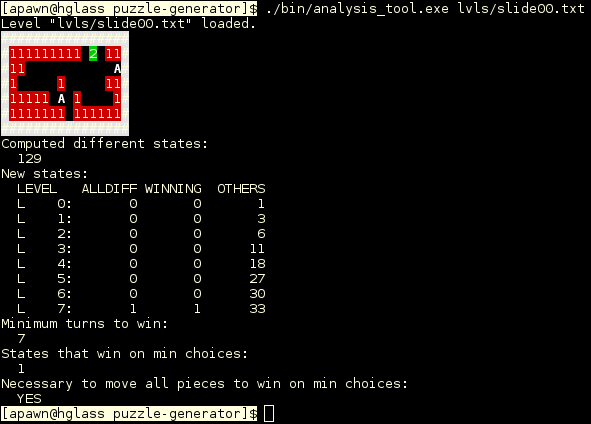

## Objetivos

* Poder estimar la **dificultad** de niveles de un puzzle, determinado por ciertas **reglas**.

* Esto para generar niveles aleatorios pero que cumplan con **requisitos de dificultad**.

## Estrategia

* Un **estado** es un conjunto de piezas con sus variables y variables generales.

* Se contruye un **grafo** con los estados alcanzables a partir del estado inicial, cada **nodo** tiene como hijos los estados que resultan de las posibles elecciones del jugador.

* Una vez se alcanza un estado, la próxima vez que se alcance se detecta que ya se alcanzó, y por lo tanto no se expande esa parte del árbol otra vez.

* Como es necesario saber cuál es la cantidad mínima de elecciones para alcanzar cierto estado, se realiza **búsqueda en amplitud**.

## Estrategia

Con el grafo, se pueden obtener varias variables que indican la dificultad de un nivel, por ejemplo:

* Cantidad mínima de decisiones para ganar.
* Formas diferentes de ganar.
* Cantidad de estados posibles hasta la cantidad mínima de decisiones.
* Si todas las formas de ganar con la cantidad mínima de decisiones exigen mover todas las piezas.

## Estrategia



## Implementación

* En el grafo, los estados son almacenados en **nodos**.

* Sólo se almacenan los estados significativos, que resultan en una **decisión** o **victoria**, no los estados *de paso*.

* Se tiene una **hash table** que almacena listas enlazadas de nodos, que sirve para comprobar si un estado existe ya o no.

* Se definió una **función hash** para este propósito.

* En cada nivel de profundidad se tiene una **cola** de todos los estados pendientes por revisar y se construye la **cola** del nivel de profundidad siguiente.

* Los **nodos** también tienen punteros a los estados derivados.

## Implementación


## Paralelización

La tarea principal es **avanzar** estados y agregar los estados derivados nuevos.

Se requerían las siguientes sincronizaciones:

* Exclusión mutua al hacer `pop` en la **cola** actual.
* Exclusión mutua al hacer `push` en la **cola** siguiente.
* Exclusión mutua al comprobar si un estado existe y agregarlo si no (en la **hash table**).
* Una *barrera* una vez se completa el nivel de profundidad, necesario para que todos los estados se registren en su nivel de profunidad menor.

## Paralelización

Esto se resolvió con:

* Un **mutex** por cada lista enlazada de la **hash table**.
* Un **mutex** para la cola actual.
* Un **mutex** para la cola siguiente y las propiedades del árbol.
* El thread principal crea los threads en cada nivel de profundidad y estos terminan cuando se vacía la cola actual, este hace *join*. Se encontró más fácil que usar una barrera.

## Pruebas

Para probar, se diseñó un puzzle que consiste en mover piezas en una dirección hasta que choquen con una pared o otra pieza y llegar a una **meta**.

Se probaron los siguientes niveles, generando el árbol hasta el nivel de profunidad mínimo para obtener una victoria, en computadores del *CSRG*:

## slide00.txt

```
################
#111111111 2 11#
#11           A#
#1     1     11#
#11111 A 1    1#
#1111111 111111#
################
Computed different states:
  129
Minimum turns to win:
  7
```

## slide02.txt

```
###################
#1111111111     11#
#11              A#
#1    A1        11#
#1   A 1         1#
#      1    2    1#
# A1            11#
#1     1 1      11#
#11 11 A 1       1#
#11 1111A111111111#
###################
Computed different states:
  169254
Minimum turns to win:
  8
```
